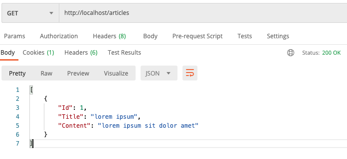

# GoDockRest 

Pre Configuration Docker for Golang Restful with Echo + MySQL

## Getting started

```sh
docker-compose up --build
```

## Available service:

- GET http://localhost
- GET http://localhost/articles



- GET http://localhost/articles/1

- GET http://localhost/phpmyadmin

## Usage

After edit code, You can reload `docker-compose restart app`

To check error You can execute `docker-compose logs -f app`

## Readmore

- https://echo.labstack.com/guide


